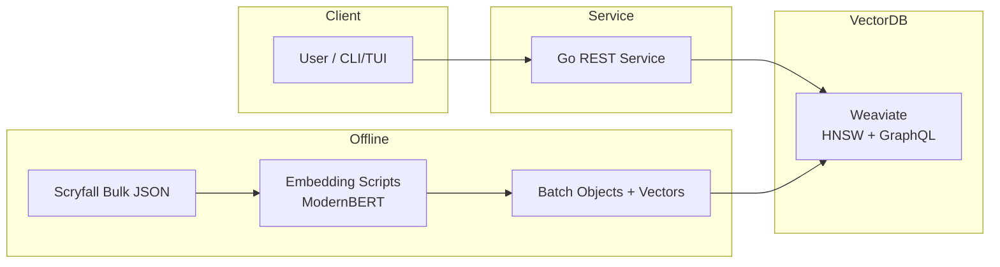
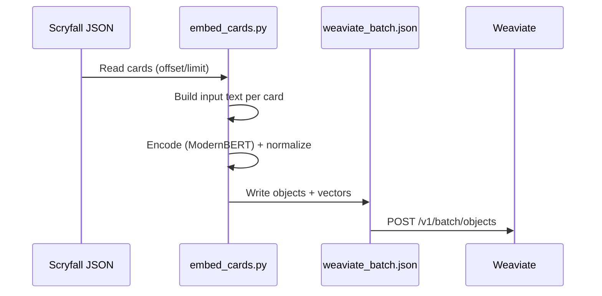
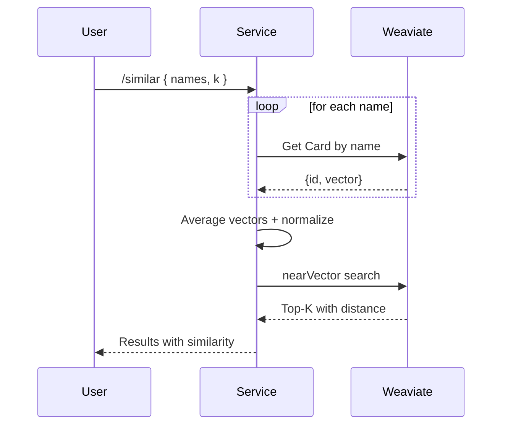
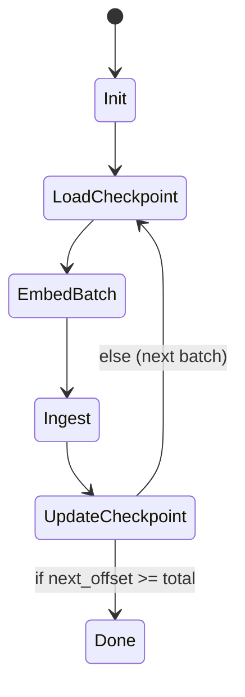

# Architecture Overview

This service recommends semantically similar Magic: The Gathering cards using text embeddings and a vector database. It runs locally and is designed to be simple to operate and extend.

## Components

- Weaviate: vector database with HNSW index and GraphQL API. Configured for bring‑your‑own vectors (`vectorizer: none`, `distance: cosine`).
- Embedding pipeline: Python scripts to build input text and embed cards with ModernBERT.
- Go REST service: translates card names to vectors, performs similarity search, and returns results.
- Scryfall data: bulk JSON of all cards (Oracle or Default). Primary ID is the Scryfall UUID.

## Data Model
- Class `Card` (Weaviate):
  - `scryfall_id: text` (also used as object `id`)
  - `name: text`, `mana_cost: text`, `cmc: number`, `type_line: text`, `oracle_text: text`
  - `power: text`, `toughness: text`
  - `colors: text[]`, `color_identity: text[]`, `keywords: text[]`
  - `edhrec_rank: int`, `set: text`, `collector_number: text`, `rarity: text`, `layout: text`
  - `image_small: text`, `image_normal: text`
  - `legalities: text` (JSON string)
  - Vector: provided externally during ingestion; indexed by HNSW with cosine distance

Multi-face handling: face texts are concatenated for embedding input and stored in `oracle_text` for display.

## Embedding Design
- Model: `Alibaba-NLP/gte-modernbert-base` (ModernBERT). Fallback to transformers mean-pooling if Sentence-Transformers is unavailable.
- Input text:
  - Type: `<type_line>`
  - ManaCost: `<mana_cost>`
  - Colors: human-readable colors (e.g., `Blue/Red`)
  - Oracle: full oracle rules text (or concatenated faces)
- Name is excluded from embeddings (reduces noise) but remains searchable as metadata.
- Vectors are L2-normalized to support cosine similarity in Weaviate.

### Mechanic‑Aware Tagging
- The embedder adds domain tags inferred from rules text and types, e.g.: `tutor`, `tutor_to_battlefield`, `attack_trigger`, `etb_trigger`, `mv_leq_3`, `type_enchantment`, `kw_aura`.
- Weighting via `EMBED_TAGS_WEIGHT` repeats the tag line N times to emphasize mechanics (set in TUI or env var). This improves nuanced effects (e.g., Zur’s attack‑triggered enchantment tutor).

## Ingestion Flow
1) Download Scryfall bulk JSON (`scripts/download_scryfall.py`).
2) Build embedding input string per card (handle multi-face, colors, etc.).
3) Encode with ModernBERT and normalize.
4) Create batch JSON with `objects` entries: `{ class: "Card", id, properties, vector }`.
5) POST to Weaviate Batch API (`scripts/ingest_batch.sh`).

Batching: `scripts/embed_cards.py` supports `--limit`, `--offset`, and `--checkpoint` to process slices. `scripts/embed_batches.sh` loops with checkpoint and ingests continuously.

## Query Flow
1) Given input `names`, the service queries Weaviate to fetch `_additional { id vector }` for each name (exact match, with a `LIKE` fallback).
2) If multiple names are provided, vectors are averaged and re-normalized.
3) Performs GraphQL `nearVector` search with a limit `k`.
4) Filters out input IDs from the results and returns top‑K with similarity (`1 - distance`).

Example Weaviate queries:
- Lookup by name and get vector:
  - `Get { Card(where:{path:["name"], operator: Equal, valueString:"Lightning Bolt"}, limit:1){ name _additional{ id vector } } }`
- Similarity search:
  - `Get { Card(nearVector:{ vector:[...] }, limit:10){ name type_line oracle_text _additional{ id distance } } }`

## REST API (Go Service)
- `GET /healthz`: health probe
- `GET /config`: returns configured Weaviate URL
- `POST /similar`:
  - Request: `{ "names": ["Card A", "Card B"], "k": 10 }`
  - Response: array of cards with metadata and similarity scores
  - Behavior: name lookup → average vectors → nearVector search → exclude inputs

Relevant code:
- `cmd/similarityd/main.go`
  - `fetchVectorForName`: exact + LIKE lookup of `_additional { id vector }`
  - `averageVectors`: centroid + L2 normalization
  - `searchNearVector`: nearVector GraphQL query
  - `doGraphQL`: GraphQL HTTP helper

## Operations
- Schema management: `scripts/apply_schema.sh` adapts to Weaviate versions that differ on allowed methods for schema endpoints. If explicit creation fails but the class exists (e.g., after batch ingest or auto-schema), it detects presence via GraphQL and proceeds.
- Batching & resume: `scripts/embed_batches.sh` uses `data/embedding_progress.json` to remember `next_offset`, enabling stop/resume.
- Environment:
  - `WEAVIATE_URL` for both service and scripts
  - `MODEL`, `INCLUDE_NAME`, `CHECKPOINT`, `OUTDIR` for embedding scripts

TUI Orchestration
- `cmd/decktech` provides a Bubble Tea CLI to run common workflows:
  - Download Scryfall bulk, apply schema, single batch, continuous batches, clean embeddings, re‑embed full, edit config, show progress
  - Streams script output and updates a progress bar from the checkpoint file

DB Browsing UIs
- `cmd/deckbrowser`: browse/search with LIKE and vector similarity from the terminal.
- `cmd/web`: SSR site to search, browse, view detailed cards (images, legalities, keywords, set/rarity), list all printings by name, and run similarity queries in the browser.

## Performance & Scale
- Data size: ~30–36k cards; vector dims 768; fits comfortably on a laptop.
- Query latency: fast (HNSW, milliseconds for top‑K at this scale).
- Embedding: CPU is fine but slower; GPU accelerates batch encoding (optional).

## Extensibility
- Filters: add GraphQL `where` clauses (colors, type, legality) to similarity queries.
- Fuzzy search: enhance name resolution or pre-compute a name index for partial matches.
- GraphQL API: expose a custom GraphQL server that wraps Weaviate with additional logic (e.g., multi-vector queries).
- Natural language: embed user text (e.g., “draw cards cost 2”) and search against card vectors.
- Reranking: add an optional cross‑encoder to rerank vector hits for precision on complex mechanics.
