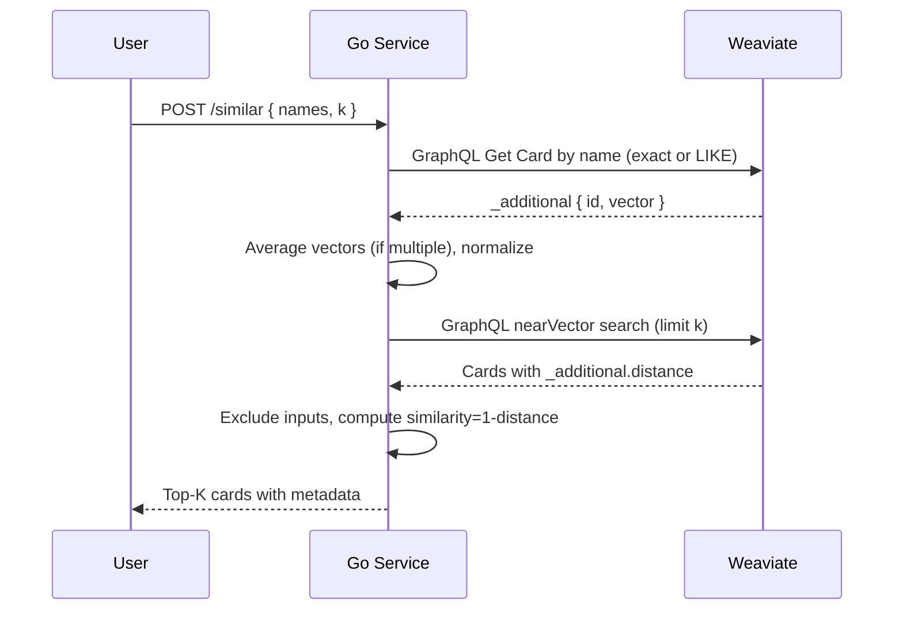

# MTG Card Similarity Service

A local-first service that recommends Magic: The Gathering cards similar to one or more input cards using text embeddings and a vector database.

- Vector DB: Weaviate (bring-your-own vectors, HNSW, cosine)
- Embeddings: ModernBERT (`Alibaba-NLP/gte-modernbert-base`), normalized
- Data: Scryfall bulk JSON
- Backend: Go REST server
  - Plus: Bubble Tea TUIs and an SSR web app for browsing/testing

## Architecture (At a Glance)

```mermaid
graph TD
    A[User / Client] -->|POST /similar| B(Go REST Service)
    subgraph Embedding Pipeline
      D1[Scryfall Bulk JSON] --> D2[Embedding Scripts\nembed_cards.py]
      D2 --> D3[Batch JSON\n(objects+vectors)]
      D3 --> C
    end
    B -->|GraphQL| C[Weaviate]
    C -->|Results| B
    B -->|Top-K Similar Cards| A
```

More detail in ARCHITECTURE.md.

## Quick Start
- Requirements:
  - `docker` + `docker compose` (to run Weaviate)
  - `go >= 1.25`
  - `python3` with `pip` (for embeddings)

- Start Weaviate
  - `docker compose -f ops/docker-compose.weaviate.yml up -d`

- Apply schema (robust to version differences)
  - `./scripts/apply_schema.sh`

- Download Scryfall bulk data
  - `python scripts/download_scryfall.py -k oracle_cards -o data/oracle-cards.json`

- Generate a small sample of embeddings (100 items) and ingest
  - `python scripts/embed_cards.py --scryfall-json data/oracle-cards.json --batch-out data/weaviate_batch.sample_100.json --limit 100 --offset 1000 --checkpoint data/embedding_progress.json`
  - `./scripts/ingest_batch.sh data/weaviate_batch.sample_100.json`

- Run the REST service
  - `go build -o ./similarityd ./cmd/similarityd`
  - `WEAVIATE_URL=http://localhost:8080 ./similarityd`

- Optional: TUI for importing/batching
  - Build: `go build -o decktech ./cmd/decktech`
  - If dependencies are missing, run: `go mod tidy` (downloads Bubble Tea packages)
  - Run: `./decktech`
  - Keys: `↑/↓` navigate, `Enter` run, `Esc` back, `q` quit
  - Actions: Download, Apply Schema, Single Batch, Continuous, Clean Embeddings, Re‑embed Full, Show Status, Edit Config
  - Config: Model, Batch size, Tags weight (mechanic emphasis), Include name

- Optional: TUI for browsing/searching
  - Build: `go build -o deckbrowser ./cmd/deckbrowser`
  - Run: `./deckbrowser`
  - Menu: `1` search by name, `2` browse list, `3` config, `q` quit
  - Interactions: `Enter` run similar from selected, `n/p` page in browse, `Esc` back

- Optional: Web UI (SSR)
  - Build: `go build -o deckweb ./cmd/web`
  - Run: `WEAVIATE_URL=http://localhost:8080 ./deckweb` then open http://localhost:8090
  - Pages: `/` search form, `/cards` browse with pagination, `/search?q=...`, `/card?id=...` (detailed view with legalities/keywords and all printings), `/similar?id=...|name=...`

- Test the endpoint
  - Get a few names from DB: `curl -sS localhost:8080/v1/graphql -H 'content-type: application/json' -d '{"query":"{ Get { Card(limit: 3) { name _additional { id } } } }"}'`
  - Query similar: `curl -sS -X POST localhost:8088/similar -H 'content-type: application/json' -d '{"names":["Wings of Aesthir"],"k":5}'`

### Request Flow



## Batched Embeddings (Recommended)
- Install deps once: `python3 -m pip install --upgrade pip && pip install transformers torch tqdm`
- Continuous batches with checkpointing:
  - `./scripts/embed_batches.sh data/oracle-cards.json 1000`
- Script behavior:
  - Reads `data/embedding_progress.json` to resume from `next_offset`
  - Produces files like `data/weaviate_batch.offset_<N>.json`
  - Ingests each batch into Weaviate automatically

```mermaid
flowchart LR
    A[embedding_progress.json\n(next_offset)] -->|offset| B[embed_cards.py\n--offset --limit]
    B -->|objects+vectors| C[weaviate_batch.offset_N.json]
    C --> D[ingest_batch.sh]
    D --> E[(Weaviate)]
    B -->|update| A
```

- Environment variables:
  - `WEAVIATE_URL`: DB endpoint (default `http://localhost:8080`)
  - `MODEL`: override model (default `Alibaba-NLP/gte-modernbert-base`)
  - `INCLUDE_NAME=1`: include card name in embedding text (default excluded)
  - `EMBED_TAGS_WEIGHT`: emphasize MTG mechanic tags in embeddings (default `2`; set via TUI)
  - `CHECKPOINT`: checkpoint JSON path (default `data/embedding_progress.json`)
  - `OUTDIR`: batch output directory (default `data`)
  - `MAX_STEPS`: stop after N batches (optional)

### Mechanic‑Aware Embeddings
- The embedder injects domain tags derived from `type_line` + `oracle_text` into the embedding input (e.g., `tutor`, `tutor_to_battlefield`, `attack_trigger`, `mv_leq_3`, `type_enchantment`).
- Control emphasis with `EMBED_TAGS_WEIGHT` (repeat tags N times); helps align nuanced cards like “Zur the Enchanter” with similar tutor/cheat effects.
- Toggle in TUI (Tags weight) or set env var when running batch scripts.

## REST API
- `GET /healthz`: returns `ok`
- `GET /config`: returns `{ "weaviate_url": ... }`
- `POST /similar`
  - Request: `{ "names": ["Card A", "Card B"], "k": 10 }`
  - Behavior: looks up vectors by name, averages multiple, runs nearest-neighbor, excludes input cards
  - Response: list of cards with `id`, `name`, `type_line`, `mana_cost`, `oracle_text`, `colors`, `image_normal`, `distance`, `similarity`

## Scripts
- `scripts/apply_schema.sh`: create or verify Weaviate schema; prints clear method/endpoint diagnostics
- `scripts/download_scryfall.py`: fetch Scryfall bulk JSON (oracle or default)
- `scripts/embed_cards.py`: embed a slice from bulk JSON (supports `--limit`, `--offset`, `--checkpoint`)
- `scripts/embed_batches.sh`: loop over batches with checkpointing and ingest
- `scripts/ingest_batch.sh`: post a batch file to Weaviate and report HTTP code
- `scripts/make_dummy_vectors.py`: generate placeholder vectors for smoke tests
- `scripts/clean_embeddings.sh`: remove local batches/checkpoint and try wiping the Card class
- `scripts/reset_checkpoint.sh`: clear `embedding_progress.json` (start from offset 0)

## Code Map
- Service entry: `cmd/similarityd/main.go`
  - `fetchVectorForName`: exact and LIKE lookup of `_additional { id vector }`
  - `averageVectors`: centroid + L2-normalization
  - `searchNearVector`: GraphQL `nearVector` query and result mapping
  - `doGraphQL`: minimal GraphQL HTTP client
- Schema + infra:
  - `weaviate/schema.json`, `scripts/apply_schema.sh`, `ops/docker-compose.weaviate.yml`
- Embeddings + ingestion:
  - `scripts/embed_cards.py`, `scripts/embed_batches.sh`, `scripts/ingest_batch.sh`
- TUI importer: `cmd/decktech` (Bubble Tea)
- DB browser TUI: `cmd/deckbrowser`
- Web SSR server: `cmd/web` (templates + assets embedded)
- Shared packages:
  - `pkg/weaviateclient`: typed GraphQL helpers for Card queries/search
  - `pkg/progress`: read/write embedding checkpoint (`next_offset`, totals)

## Makefile
- `make weaviate-up` / `weaviate-down`: start/stop DB
- `make schema-apply`: apply/verify schema
- `make data-download`: pull Scryfall bulk
- `make embed-sample` + `ingest-sample`: quick sample run
- `make embed-batches BATCH=1000`: continuous embedding + ingest with checkpoint
- `make tui` / `browser` / `web`: run UIs
- `make clean-embeddings`: wipe local batches/checkpoint (and try DB class delete)

## Decisions
- Embedding model: `Alibaba-NLP/gte-modernbert-base`
- Name in embeddings: excluded (but searchable as metadata)
- API style: REST first (`/similar`), GraphQL later if needed
- Legalities: stored as JSON string in `legalities`

## Troubleshooting
- Docker not running: `docker compose` fails; start Docker Desktop/OrbStack first
- Schema apply 405/404:
  - Different Weaviate versions expose different methods; the script tries POST/PUT on both endpoints and falls back to a GraphQL presence check
- 400 Bad Request on `/similar`:
  - Ensure `-H 'content-type: application/json'` and valid JSON body
- “card not found”:
  - Name not present in current subset; ingest more batches or use a name returned by a GraphQL `Get { Card }` query
- No vectors:
  - If you ingested dummy batches first, those vectors are random; ingest real embedding batches to get meaningful results

## More
- See `ARCHITECTURE.md` for system design and rationale
- See `docs/PROJECT.md` for the full original plan and milestones
